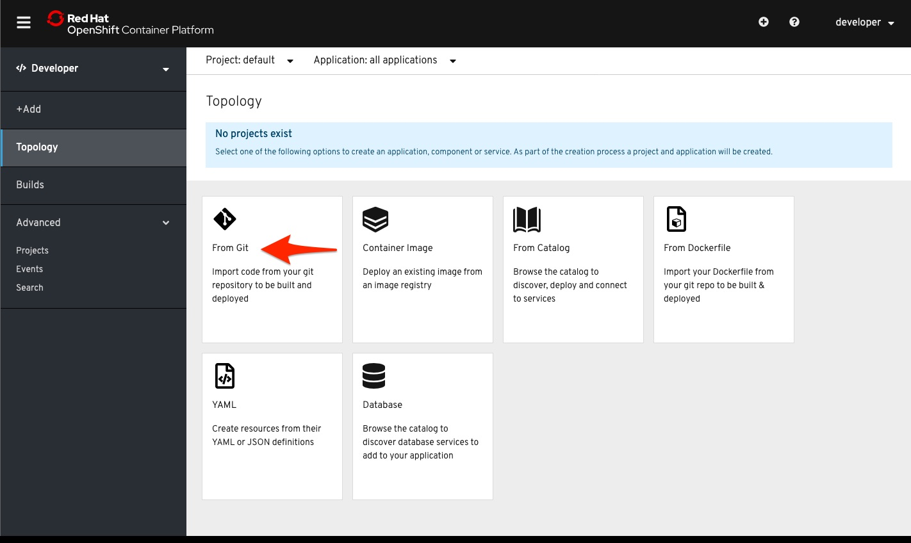
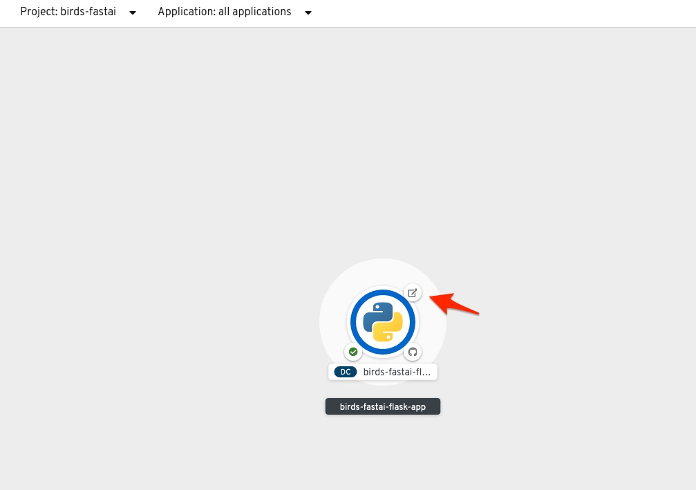
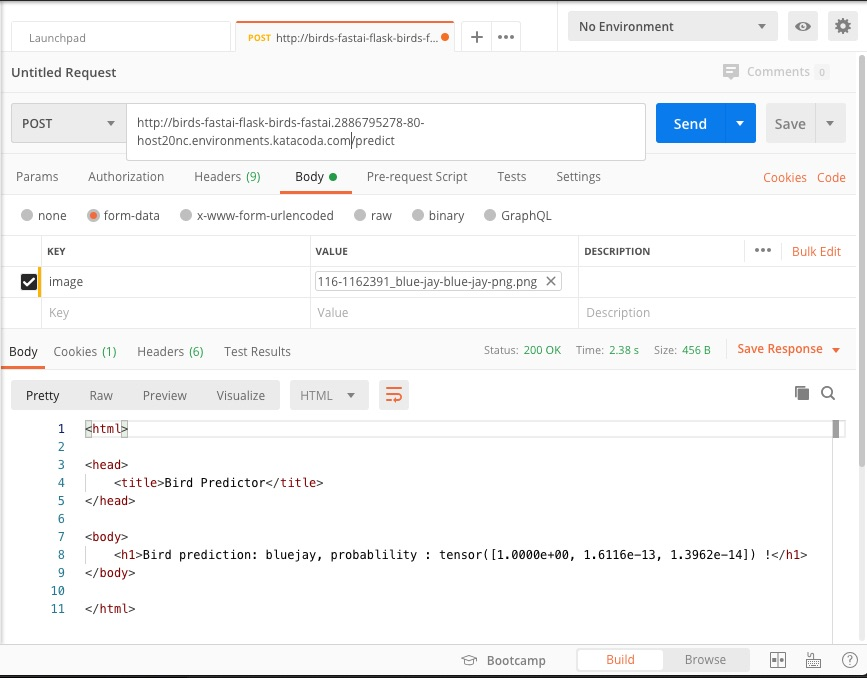

# Bird Classification with Fast.AI 

## Overview

This project demonstrates the creation of a deep-learning bird classifier model and the deployment of the model. 

### Model Creation  

The model is created using the birds.ipynb notebook.   The notebook was adapted from the [Fast.AI Course v3 Lesson 2](https://course.fast.ai/videos/?lesson=2).  The lesson2-download.ipynb notebook demonstrates how to download images using Google Image and use those to train and test a model. 

The notebook was executed on a Power System with Nvidia GPUs.  The anaconda environment was created using the fastai.yml file in the project.   The fastai environment includes Fast.AI and Watson Machine Learning - Community Edition.   

``` 
git clone https://github.com/jvanoosten/birds-fastai-flask
cd birds-fastai-flask
source <conda-home>/anaconda3/etc/profile.d/conda.sh
conda env create --file fastai.yml
conda activate fastai
jupyter notebook --ip 0.0.0.0 --no-browser
```

### Model Export 


The model is exported in pickel format toward the bottom of the notebook.

```
learn.export('birds.pkl') 
```

### Standalone Flask App 

The app.py is a Flask application that loads the model and provides a `predict` RESTful POST API that accepts a bird image file in form-data with an `image` key.

The application can be run standalone or in a Red Hat OpenShift cluster. 

To run it standalone: 

``` 

python app.py

```

The initial flask data output shows.  The HTTP result for `predict` API request will be show. 

```
* Serving Flask app "app" (lazy loading)
 * Environment: production
   WARNING: This is a development server. Do not use it in a production deployment.
   Use a production WSGI server instead.
 * Debug mode: on
 * Running on http://0.0.0.0:8080/ (Press CTRL+C to quit)
 * Restarting with stat
 * Debugger is active!
 * Debugger PIN: 662-117-209
```

### OpenShift Flask App via GitHub Project Import 

The application can also be deployed in a Red Hat OpenShift cluster.   An [OpenShift 4.2 playground](https://learn.openshift.com/playgrounds/openshift42/) can be created at by signing in as a Red Hat developer.   After the playground is created, sign-on via the `console` using the developer / developer credentials.   Change the Role from 
Administrator to Developer and select Topology on the left of the console.   From there you import the code from the git project. 




Press the create button to create the project and begin the build.

Once the build is complete, the app will have a dark blue ring filled around it and the Open URL will be active in the top right corner of the application circle. 
 


The application's POST API `predict` method can be now be called as shown via Postman program. 




